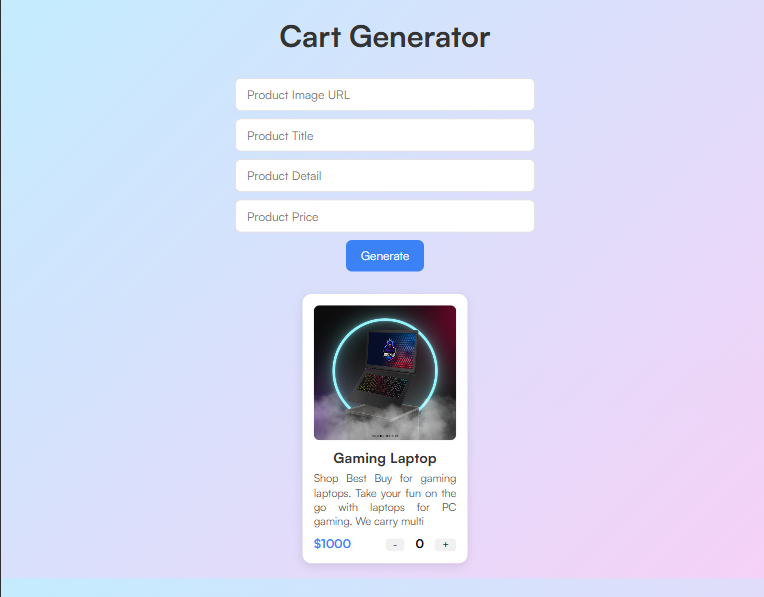

# Cart Generator 🛒

A simple cart generator project that demonstrates basic cart functionality for e-commerce applications.

[](https://thiyo-de.github.io/Cart-Generator/)
 <!-- Add your screenshot file and replace this if needed -->

## Features

- Add items to cart
- Remove items from cart
- Adjust item quantities
- Calculate total price
- Responsive design

## Demo

Try the live demo: [https://thiyo-de.github.io/Cart-Generator/](https://thiyo-de.github.io/Cart-Generator/)

## Technologies Used

- HTML
- CSS
- JavaScript

## Installation

1. Clone the repository:
   ```bash
   git clone https://github.com/thiyo-de/Cart-Generator.git
